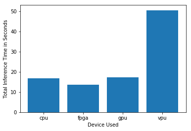

# Computer Pointer Controller

Gaze Cursor Control program is designed to control mouse pointer using real time video input. User can provide either video or live camera streaming as input.

## Project Set Up and Installation

### Step: 1
Make sure you have installed **openVINO 2020.2.+**
### Step: 2
Clone the repository: https://github.com/zeeshananjumjunaidi/gaze-cursor-control
### Step: 4
- Make sure you have installed python3.5
- for Linux run ```python -m pip install -r requirements.txt```
- for Windows run ```python -m pip install -r requirements-win.txt```

### Step: 5
Initialize the openVINO environment:

**Linux**
```
source /opt/intel/openvino/bin/setupvars.sh -pyver 3.5
```
**Windows**
```
<openvino-directory\bin\setupvars.bat>
```
### Step 3
Download following models by using OpenVINO model downloader

**Linux**

- **1. Face Detection Model**
```
python /opt/intel/openvino/deployment_tools/tools/model_downloader/downloader.py --name "face-detection-adas-binary-0001"  --output_dir models/intel
```
- **2. Facial Landmarks Detection Model**
```
python /opt/intel/openvino/deployment_tools/tools/model_downloader/downloader.py --name "landmarks-regression-retail-0009"  --output_dir models/intel
```
- **3. Head Pose Estimation Model**
```
python /opt/intel/openvino/deployment_tools/tools/model_downloader/downloader.py --name "head-pose-estimation-adas-0001"  --output_dir models/intel
```
- **4. Gaze Estimation Model**
```
python /opt/intel/openvino/deployment_tools/tools/model_downloader/downloader.py --name "gaze-estimation-adas-0002"  --output_dir models/intel
```

**Windows**

- **1. Face Detection Model**
```
python <openvino-directory>/deployment_tools/tools/model_downloader/downloader.py --name "face-detection-adas-binary-0001"  --output_dir models/intel
```
- **2. Facial Landmarks Detection Model**
```
python <openvino-directory>/deployment_tools/tools/model_downloader/downloader.py --name "landmarks-regression-retail-0009"  --output_dir models/intel
```
- **3. Head Pose Estimation Model**
```
python <openvino-directory>/deployment_tools/tools/model_downloader/downloader.py --name "head-pose-estimation-adas-0001"  --output_dir models/intel
```
- **4. Gaze Estimation Model**
```
python <openvino-directory>/deployment_tools/tools/model_downloader/downloader.py --name "gaze-estimation-adas-0002"  --output_dir models/intel
```


## Demo

Edit run.sh and update the path of models.
- Linux

Open terminal and navigate to project root directory.
Then run ```./run.sh```
You can edit run.sh to change parameters, like if you want to provide video file input or use model from different location etc...

- Windows

Open command prompt and navigate to project root folder.
Then run ```run.bat```
You can edit run.bat to change parameters, like if you want to provide video file input or use model from different location etc...

Parameters can be changed in run.sh *(for Linux)* & run.bat *(for Windows)*


## Documentation


### Models Documentation:
- [Face Detection Model](https://docs.openvinotoolkit.org/latest/_models_intel_face_detection_adas_binary_0001_description_face_detection_adas_binary_0001.html)
- [Facial Landmarks Detection Model](https://docs.openvinotoolkit.org/latest/_models_intel_landmarks_regression_retail_0009_description_landmarks_regression_retail_0009.html)
- [Head Pose Estimation Model](https://docs.openvinotoolkit.org/latest/_models_intel_head_pose_estimation_adas_0001_description_head_pose_estimation_adas_0001.html)
- [Gaze Estimation Model](https://docs.openvinotoolkit.org/latest/_models_intel_gaze_estimation_adas_0002_description_gaze_estimation_adas_0002.html)

### App Parameters

```
usage: main.py [-h] -f FACEDETECTION -fl FACIALLANDMARK -hp HEADPOSE -g
               GAZEESTIMATION -i INPUT [-l CPU_EXTENSION]
               [-prob PROB_THRESHOLD] [-d DEVICE] [-pf] [-pfl] [-php] [-pge]
               -fliph FLIP_HORIZONTAL

optional arguments:
  -h, --help            show this help message and exit
  -f FACEDETECTION, --facedetection FACEDETECTION
                        Path of Face Detection Model .xml file. required*
  -fl FACIALLANDMARK, --faciallandmark FACIALLANDMARK
                        Path of Face Landmark Model .xml file. required*
  -hp HEADPOSE, --headpose HEADPOSE
                        Path of Head Pose Model .xml file. required*
  -g GAZEESTIMATION, --gazeestimation GAZEESTIMATION
                        Path of Gaze Estimation model .xml file. required*
  -i INPUT, --input INPUT
                        Provide video path or write "cam" for camera
                        streaming. required*
  -l CPU_EXTENSION, --cpu_extension CPU_EXTENSION
                        Provide CPU extension
  -prob PROB_THRESHOLD, --prob_threshold PROB_THRESHOLD
                        probability threshold for face detection values from
                        0.1 to 1
  -d DEVICE, --device DEVICE
                        Target device to be used by OpenVINO.CPU, GPU, FPGA or
                        MYRIADRead https://docs.openvinotoolkit.org/latest/_do
                        cs_IE_DG_inference_engine_intro.html for more
                        information.default: CPU
  -pf, --previewFaceDetection
                        Preview face detection
  -pfl, --previewFaceLandmark
                        Preview face landmarks
  -php, --previewHeadPose
                        Preview head pose
  -pge, --previewGazeEstimation
                        Preview gaze esitmation vector
  -fliph FLIP_HORIZONTAL, --flip_horizontal FLIP_HORIZONTAL
                        Flip input horizontally, incase of video is flipped
                        horizontally
```

### Project Structure

- **.run.sh** (for Linux) Main file to run the Gaze Cursor Control pipeline. 
- **.run.bat**  (for Windows) Main file to run the Gaze Cursor Control pipeline. 
- src folder contains all models definition, including input feeder, mouse controller, and main pipeline to run.
- src/main.py Main pipeline file to run this project. This require input of models, video stream, and device to be used for inference.
- src/mouse_controller.py this file contain MouseController class which take x,y coords., speed, and precision and set those values to actual mouse pointer.
- src/face_detection_model.py Used for face detection
- src/face_landmark_model.py Used for detecting eyes in a given face.
- src/head_pose_model.py Used for detecting Head pose/ orientation.
- src/gaze_estimation_model.py Used for gaze prediction given left, right eyes and head pose angles.
- src/input_feeder.py Contains InputFeeder class to initialize camera and return frame sequentially.
- models folder contains models provided by the Intel for face detection, landmark detection, gaze estimation, and head pose prediction.
- media folder contains demo input files for testing this program.

## Benchmarks

Following result is taken on Virtual Machine (Intel® Core™ i7-7700 Processor @4.40GHz).

|            Name           | Model Load Time FP32 | Inference time (FP32) |
|:-------------------------:|:------------:|:--------------------------:|
| Face detection            | 0.172        | 0.008                      |
| Face Landmark detection   | 0.057        | 0.0007                      |
| Head Pose Estimation      | 0.062        | 0.002                      |
| Gaze Estimation           | 0.080        | 0.001                      |
| **Total Average**             | 0.092          |0.003                      |

|            Name           | Model Load Time FP16 | Inference time (FP16) |
|:-------------------------:|:------------:|:------------------------:|
| Face detection            | 0.348           | 0.013                      |
| Facial Landmark detection | 0.105        | 0.0001                    |
| Head Pose detection       | 0.173        | 0.002                    |
| Gaze Estimation           | 0.170       | 0.003                    |
| **Total Average Inference**   | 0.199       | 0.004                    |

|   Model Type  |   FPS     |
|:----------:|:------------:|
|   FP32        |  ~13FPS    |
|   FP16        |  ~12FPS         |


Result on Intel® Core™ i7-4702MQ @ 2.20GHz Processor

|            Name           | Model Load Time FP32 | Inference time (FP32) |
|:-------------------------:|:------------:|:--------------------------:|
| Face detection            | 0.6873111724853516        | 0.030996084213256836                      |
| Face Landmark detection   | 0.2661552429199219        | 0.0010018348693847656                      |
| Head Pose Estimation      | 0.21300029754638672        | 0.001981973648071289                      |
| Gaze Estimation           | 0.24499297142028809        | 0.002998828887939453                      |
| **Total Average**         | 0.3528649210929870775      |  0.0092446804046630859                      |

|            Name           | Model Load Time FP16 | Inference time (FP16) |
|:-------------------------:|:------------:|:------------------------:|
| Face detection            | 0.5799996852874756           | 0.028020381927490234                      |
| Facial Landmark detection | 0.16299867630004883        | 0.0010178089141845703                    |
| Head Pose detection       | 0.17101383209228516        | 0.0009822845458984375                    |
| Gaze Estimation           | 0.21700549125671387       | 0.0029838085174560547                    |
| **Total Average Inference**   | 0.282754421234130865      | 0.008251070976257324125                    |

|   Model Type  |   FPS     |
|:----------:|:------------:|
|   FP32        |  ~14FPS    |
|   FP16        |  ~16FPS         |

Result on IGPU Intel® HD Graphics 4600

|            Name           | Model Load Time FP32 | Inference time (FP32) |
|:-------------------------:|:------------:|:--------------------------:|
| Face detection            | 0.3946526050567627        |  0.026006698608398438                      |
| Face Landmark detection   | 0.16802239418029785        | 0.0009887218475341797                      |
| Head Pose Estimation      | 0.18301916122436523        | 0.002997159957885742                      |
| Gaze Estimation           | 0.22898149490356445        | 0.0020008087158203125                      |
| **Total Average**         | 0.243668914      |  0.007998347                     |

|            Name           | Model Load Time FP16 | Inference time (FP16) |
|:-------------------------:|:------------:|:------------------------:|
| Face detection            | 0.5998866558074951          | 0.026001930236816406                      |
| Facial Landmark detection | 0.17197704315185547         | 0.0009853839874267578                    |
| Head Pose detection       | 0.18929433822631836         | 0.0020143985748291016                    |
| Gaze Estimation           | 0.22699999809265137         | 0.0020155906677246094                    |
| **Total Average Inference**   | 0.282754421234130865      | 0.007754326                    |

|   Model Type  |   FPS     |
|:----------:|:------------:|
|   FP32        |  ~16FPS    |
|   FP16        |  ~16FPS         |


## Results

I tested this program on Intel i7 (7700K) VM. From the results, it seems like FP16 too long time for loading, but for i7 (7700K) loading time is low and there is not much difference in model inference as FPS are almost similar in both type of the models.
Higher floating point precision usually have higher accuracy.

Normally higher precision model usually takes more time for inference than lower precision models.

From the result, we can see that loading time and inference time of FP16 is slower than the FP32 by 10ms in virtual machine although
it is running on i7 7700 4.40GHz. While on i7 4702MQ 2.20GHz, FP16 seems faster than FP32 by average of 2FPS and 0.20ms.


We prefer using lower precision model when we have constraints such as low power consumption and less processing power.

<hr/>

### Testing face detection model on different hardware.

I tested Face detection model on multiple devices.
- **CPU** - i5-6500te:iei-mustang-f100-a10  - FP32
- **IGPU** - i5-6500te:intel-hd-530 - FP32
- **VPU** - intel-ncs2 - FP32
- **FPGA** - iei-mustang-f100-a10 - FP16


#### Model Loading Time


#### Inference Time 


#### FPS


### Edge Cases
1. If program unable to find face in video input, it will print 'Unable to detect the face' and continue to read another frame.
2. Model will use only one face detected in the streaming.
